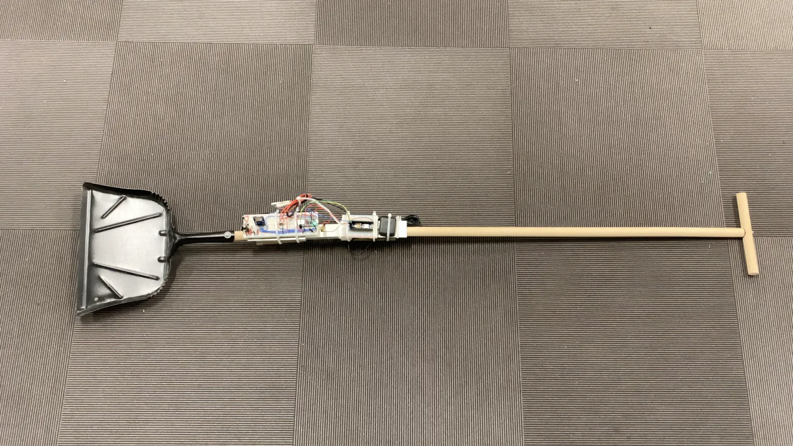
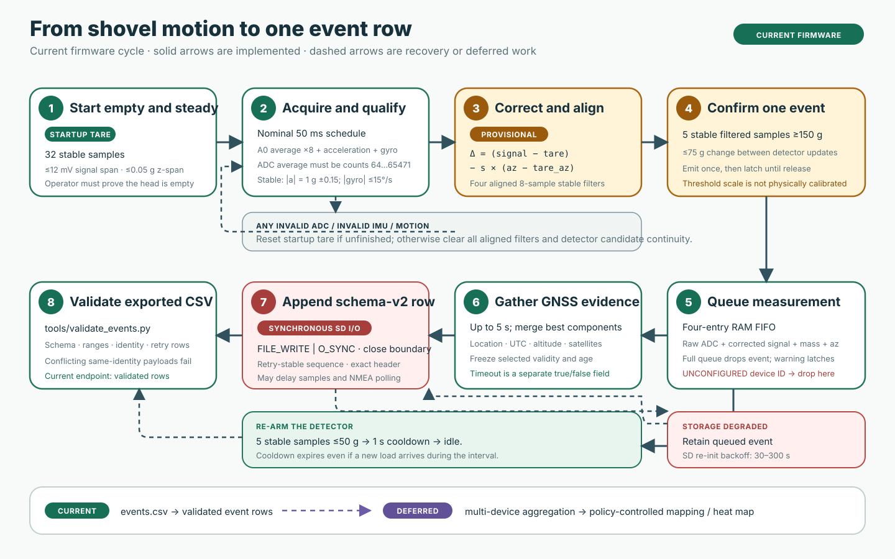
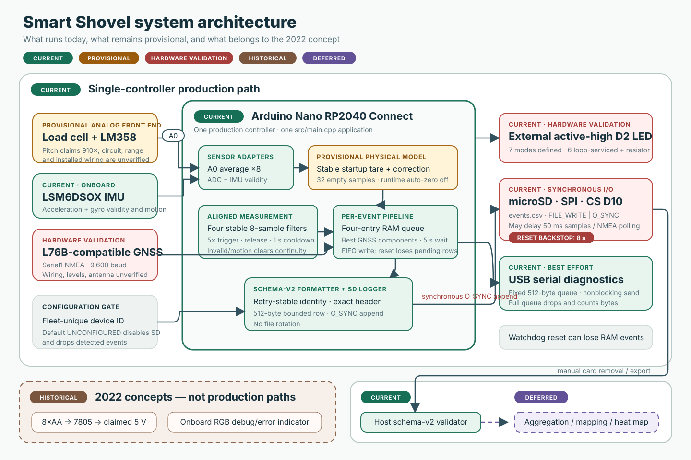

# Smart Shovel

Smart Shovel is an open-source firmware prototype for measuring waste collected
with a shovel, associating each collection event with GNSS location and UTC
time, and writing aggregation-ready CSV records to a microSD card. The original
2022 project was motivated by the need for higher-volume data about uncollected
waste in Accra, Ghana without adding a separate reporting step to collectors'
work.

This repository now has one production application for an **Arduino Nano RP2040
Connect**, deterministic host tests, a pinned board build, CI, and reproducible
calibration analysis. It does **not** claim that the refined firmware has been
validated on the physical shovel. The historical prototype claims, evidence,
contradictions, and current requirement statuses are traced in
[`docs/project-requirements.md`](docs/project-requirements.md).



*Historical 2022 prototype photograph—not evidence that the refined firmware
has run on this assembly. The exposed hardware is not weatherproof or approved
for field use.*

> **Calibration warning:** the orientation coefficient is reproducible from
> preserved data, but its recorded units still need hardware confirmation. The
> legacy `-15 g/mV` mass factor has no tracked raw known-mass dataset and is
> explicitly marked `provisional` in every record until replaced through a
> physical calibration.

## How it works



The current firmware measures one stable collection event, associates the best
available GNSS/time evidence, and synchronously appends one schema-v2 row to the
microSD card. The host validator checks exported rows; multi-device aggregation
and heat-map generation are future downstream work, not current firmware.

[Explore the simulated collection cycle](docs/demo/index.html) or read the
[complete visual guide](docs/visual-guide.md). The demo is deterministic
documentation—not live telemetry or new physical test evidence. GitHub does not
execute its JavaScript inline; run it locally with:

```sh
python3 -m http.server 8000 --directory docs
# open http://localhost:8000/demo/
```

## What the production firmware does

- Initializes the analog input, onboard LSM6DSOX IMU, L76B-compatible NMEA GNSS
  stream, microSD card, serial diagnostics, and a configurable external status
  LED independently.
- Acquires a stable startup tare while the shovel is empty, then applies the
  preserved z-acceleration orientation model in millivolts.
- Filters mass readings and emits one event only after threshold, motion,
  stability, debounce, hysteresis, release, and cooldown checks pass.
- Rejects ADC values within 64 counts of either nominal rail. Invalid ADC/IMU
  data or motion breaks candidate continuity and clears all aligned filters, so
  an emitted window is rebuilt from eight stable samples before the five-sample
  detector confirmation.
- Keeps runtime zero maintenance fail-closed. The bounded auto-zero algorithm is
  host-tested, but production always rejects its updates because the current
  hardware has no independent way to prove that a stable shovel is unloaded.
- Polls GNSS continuously without blocking. During an event's five-second wait,
  it retains the best independently valid location, UTC, altitude, and satellite
  evidence seen. The row keeps the underlying GNSS status and separately records
  whether the event wait timed out.
- Appends a versioned CSV record, flushes and closes it at the event boundary,
  avoids duplicate headers, refuses a mismatched existing schema, and uses a
  per-boot session ID plus retry-stable sequence for aggregation identity.
- Continues sensing when GNSS or storage is unavailable, retries recoverable
  peripherals, buffers up to four pending events, and reports degraded states
  without intentional infinite loops.
- Uses an 8 s hardware watchdog as the final bound on otherwise blocking board
  dependency calls. A watchdog reset is reported at next boot, but any RAM-only
  pending events are lost.

Audio, Wi-Fi serving, and dual-controller master/slave code are not part of the
MVP. They are preserved under [`legacy/`](legacy/) as unvalidated experiments.

## System architecture



The single-controller architecture follows the pitch's interaction diagram and
the only integrated 2022 sketch. The historical BOM lists two Nano Connect
boards, while the repository photographs contain board-format assemblies that
are consistent with one Nano and an L76B GNSS carrier but do not establish the
complete architecture. The unfinished master/slave sketches never implemented
a usable protocol. That ambiguity is
resolved reversibly: one controller is production, while the dual-board work
remains available in legacy history.

## Confirmed and provisional hardware

| Item | Prototype evidence | Production assumption / status |
| --- | --- | --- |
| Controller | Arduino Nano RP2040 Connect | Confirmed target; PlatformIO board `nanorp2040connect` |
| Load sensing | Unidentified load cell and custom LM358 circuit, historically reported as 910× gain | Amplified single-ended signal on A0; model/rating/gain and ADC safety require bench validation |
| Orientation | Onboard LSM6DSOX | `Arduino_LSM6DSOX` 1.1.2; no external pins |
| GNSS | Waveshare L76B named in pitch/BOM | NMEA at 9600 baud on default `Serial1`; electrical/interface details require confirmation |
| Storage | Generic SPI microSD module | Hardware SPI, CS D10; supply voltage and level shifting must be confirmed for the actual module |
| Status | Pitch describes the onboard RGB LED | Production uses one external, active-high LED on D2 through a current-limit resistor; this reversible fail-safe deviation avoids the SPI-shared built-in LED pin and the NINA-coprocessor RGB path, but needs hardware/operator validation |
| Prototype power | Eight AA cells and 7805 regulator | Historical only; runtime, thermal behavior, protection, grounding, and safe Nano power entry are unverified |

### Wiring and pins

The pitch contains a logical interaction diagram, not a GPIO schematic. The
table below records only the code and board-default assumptions. Verify every
connection against the actual board/module before applying power.

| Function | Nano connection | External connection | Evidence / caveat |
| --- | --- | --- | --- |
| Load-cell amplifier output | `A0` | Amplifier signal output | Confirmed by 2022 code. **A0 must remain between GND and 3.3 V.** |
| GNSS receive | `D0 / RX` | GNSS `TX` | Default Nano RP2040 Connect `Serial1`; legacy header named the pins inconsistently |
| GNSS transmit | `D1 / TX` | GNSS `RX` | Only needed if configuring the receiver; verify logic levels |
| SD chip select | `D10` | SD `CS` | Confirmed by logger and historical diagnostics |
| SD controller-out | `D11 / COPI` (`MOSI`) | SD `MOSI` | Board-default hardware SPI; pitch gives no Nano pin map |
| SD controller-in | `D12 / CIPO` (`MISO`) | SD `MISO` | Board-default hardware SPI; verify module level shifting |
| SD clock | `D13 / SCK` | SD `SCK` | Board-default hardware SPI |
| Status LED | `D2` | LED anode through a suitable current-limit resistor; cathode to GND | Reversible active-high default only; verify resistor, polarity, visibility, and installed wiring |
| Common reference | `GND` | All module grounds | Required electrically; the archived diagrams do not document grounding topology |

Do not infer that the historical “5 V to all components” statement makes 5 V
safe at RP2040 I/O. It does not. The exact regulator, module supply, load-cell
excitation, amplifier rails/output range, and connector polarity must be
reviewed on the physical assembly.

## Repository layout

```text
src/                         single production Arduino application and adapters
include/smart_shovel/        centralized firmware and local-device configuration
lib/smart_shovel_core/       Arduino-independent, allocation-free domain logic
test/test_core/              deterministic PlatformIO Unity host tests
calibration/data/raw/        immutable 2022 CSV evidence
tools/analyze_calibration.py reproducible standard-library calibration CLI
tools/validate_events.py    schema-v2 export validation before aggregation
examples/hardware/           isolated bench diagnostics, not production
legacy/                      archived sketches, experiments, and stale notebook
docs/assets/                 optimized photographs and static SVG explanations
docs/demo/                   framework-free interactive simulated collection cycle
docs/                        visual guide, requirements traceability, and gates
.github/workflows/ci.yml     host tests, analysis, static checks, and board build
```

There is exactly one production entry point: [`src/main.cpp`](src/main.cpp).
PlatformIO does not compile `examples/` or `legacy/`.

## Reproducible setup

Requirements:

- Python 3.11 or later
- A host C++17 compiler
- `clang-format` and `cppcheck` for the complete local verification gate
- A data-capable USB cable for upload/monitoring

Create an isolated environment and install the pinned PlatformIO Core:

```sh
python3 -m venv .venv
. .venv/bin/activate
python -m pip install -r requirements-dev.txt
```

On Ubuntu, install the two system analysis tools with:

```sh
sudo apt-get install clang-format cppcheck
```

On macOS with Homebrew:

```sh
brew install clang-format cppcheck
```

Run the host and firmware checks:

```sh
make test-python
make calibration-check
make validate-events EVENTS=path/to/events.csv
make test-native
make build-firmware
make format-check
make static-check
make secret-check
make docs-check
```

`make verify` runs the complete non-hardware gate used by CI. The firmware build
also checks the generated `firmware.bin` against the conservative 2 MiB
PlatformIO application-image budget instead of relying only on its misleading
Mbed program estimate.
Tool, platform, board, and Arduino library versions are pinned in
`requirements-dev.txt` and `platformio.ini`.

## Configure, build, upload, and monitor

The default build deliberately uses device ID `UNCONFIGURED` and the historical
provisional mass factor. With that fail-safe ID, detected events are dropped and
SD logging remains disabled; serial reports the reason. For a supervised unit,
copy the example and edit only the ignored local file:

```sh
cp include/smart_shovel/device_config.example.hpp \
  include/smart_shovel/device_config.hpp
```

Use a stable fleet-unique ID of at most 24 characters containing only letters,
digits, `.`, `_`, or `-`. Do not use a person's name or encode collector
identity. A device ID, random 16-hex-digit boot-session ID, and sequence number
together form the aggregation identity.

Compile and upload:

```sh
pio run -e nanorp2040connect
pio run -e nanorp2040connect --target upload
pio device monitor --baud 115200
```

At startup, keep the shovel head empty and motionless until the LED stops its
slow calibration blink and serial reports `tare=ready`. No software can
distinguish a perfectly stable load present at first boot from the empty shovel
without an independent reference; the empty-start condition is therefore a
required operator and test precondition.

## Calibration

### 1. ADC and zero

The firmware requests 16-bit Arduino API output and nominally converts counts as

```text
millivolts = counts × 3300 / 65536
```

The RP2040's effective accuracy is not established by requesting a 16-bit API
value. Measure the actual reference, noise, clipping, and amplifier range. On
each boot, 32 stable empty samples establish both signal and z-acceleration tare
points under the operator precondition above. Runtime auto-zero remains disabled
even when a mass calibration is marked verified: the weight channel alone cannot
prove that a small stable reading is an empty shovel. The allocation-free core
contains a bounded, host-tested tracker for a future independently asserted
unloaded input, but production passes that gate as false for every sample.

### 2. Orientation compensation

Reproduce the supported historical fit without modifying raw data:

```sh
python tools/analyze_calibration.py \
  --input calibration/data/raw/calib1.csv \
  --hac-lags 5
```

For `calib1.csv`, ordinary least squares gives approximately:

```text
voltage = -74.7089168 × az + 25.2884374
R² = 0.9151767
OLS 95% slope interval = [-76.5086, -72.9093]
HAC(5) approximate interval = [-77.7538, -71.6640]
```

Residuals are autocorrelated, files overlap, and the old producer is missing,
so this remains provisional physical evidence. The firmware applies the slope
in the labeled millivolt domain and cancels the intercept through tare-relative
correction:

```text
corrected_delta_mv = (measured_mv - tare_mv)
                   - slope × (az - tare_az)
```

See [`calibration/README.md`](calibration/README.md) for hashes, schemas,
overlap, uncertainty, and data limitations.

### 3. Grams conversion

The repository has no raw signal paired with traceable known masses. Before
field use:

1. Warm up the complete powered assembly and record measured ADC reference.
2. Tare the empty, stable shovel in its representative orientations.
3. Apply several traceable masses across the intended range, including repeated
   zero, loading, and unloading points.
4. Record raw ADC, all IMU axes, device/run/tare IDs, timestamps, temperature if
   relevant, saturation, and the true applied mass.
5. Fit grams versus orientation-corrected millivolts; inspect residuals,
   nonlinearity, hysteresis, drift, and held-out-run/device error.
6. Put the resulting slope in local `device_config.hpp` and set
   `SMART_SHOVEL_MASS_CALIBRATION_VERIFIED` to `1` only after the acceptance
   range and procedure are documented.

Until then, mass values are useful only for software/prototype evaluation and
carry `mass_calibration_status=provisional`.

## Collection-event behavior

Defaults live in [`include/smart_shovel/config.hpp`](include/smart_shovel/config.hpp):

- 50 ms sampling and an 8-sample moving average
- 150 g trigger and 50 g release thresholds
- five consecutive stable trigger samples and five release samples
- 75 g maximum change between candidate samples
- 1 s cooldown after release
- acceleration magnitude within 0.15 g of gravity and gyro magnitude at or
  below 15 degrees/s for a stable sample
- 5 s GNSS event wait and freshness limit
- four pending events during temporary GNSS/storage degradation
- 5 s IMU reinitialization attempts after startup or repeated read failure
- SD reinitialization backoff from 30 s to 300 s
- 64-count ADC rail margins; 20 consecutive ADC/IMU faults latch sensor status
- 8 s hardware watchdog for dependency hangs

These thresholds are host-tested state-machine settings, not validated physical
performance. The 50 g release window defines the provisional meaningful-load
boundary; it does not authorize auto-zero. Re-characterize all thresholds on
hardware before field use.

## CSV schema

The firmware creates `events.csv`. It writes the header only for a new/empty
file and refuses to append if an existing nonempty file has another header.
The row below is a deterministic synthetic example, not field telemetry:

```csv
schema_version,device_id,boot_session_id,event_sequence,event_uptime_ms,timestamp_utc,mass_g,mass_calibration_status,corrected_signal_mv,raw_adc,accel_z_g,latitude,longitude,altitude_m,gps_age_ms,satellites,gps_status,gps_wait_timed_out,system_health
2,SS-001,9F3A7C10B4D2E681,42,123456,2026-07-15T08:30:01Z,412.750,provisional,-27.517,30214,0.982100,5.6037000,-0.1870000,24.30,220,9,valid,false,healthy
```

Optional invalid data is an empty field, never an uninitialized or silently
reused value. Status values are:

- `mass_calibration_status`: `unavailable`, `provisional`, or `verified`
- `gps_status`: `valid`, `location_only`, `no_fix`, `invalid`, `stale`, or
  `timeout`
- `gps_wait_timed_out`: lowercase `true` or `false`
- `system_health`: `healthy`, `gps_degraded`, `storage_degraded`, or
  `gps_and_storage_degraded`

`event_uptime_ms` is the detection time on that boot; `timestamp_utc` is the
fresh GNSS time accepted for the event. Latitude/longitude are decimal degrees,
altitude is meters, mass is grams, corrected signal is millivolts, and
`gps_age_ms` records location age when that component is selected during the
event window. During the wait, the firmware merges location, date/time,
altitude, and satellites component by component so a later incomplete NMEA
update cannot erase better evidence. Selected validity/age is frozen for the
event rather than aging until a delayed SD write. If the five-second wait
expires, `gps_status` describes the retained evidence while
`gps_wait_timed_out=true`; current production does not replace that evidence with
the generic `timeout` enum value.

Each boot creates a random 64-bit session value rendered as 16 hexadecimal
characters. Sequence starts at 1 for that session and, once assigned to a queued
event, remains unchanged across SD write retries. The logger checks the exact
schema-v2 header and inserts a newline after an interrupted tail before
appending. Event writes use `O_SYNC`, so a reported success includes data, FAT,
and directory synchronization as exposed by pinned SD 1.3.0. A power
interruption can still leave a malformed row or a sequence gap, but a new boot
session prevents identity reuse. Deduplicate on
`(device_id, boot_session_id, event_sequence)`, not sequence alone. Session
randomness makes cross-boot collision extremely unlikely rather than
mathematically impossible; aggregation software must still validate rows.

Validate every removed card before aggregation:

```sh
make validate-events EVENTS=/path/to/events.csv
```

The validator rejects malformed rows, invalid fields, and conflicting payloads
for one identity. An identical repeated row is classified as an ambiguous-write
retry duplicate so downstream importers can deduplicate it deliberately.

`events.csv` is one growing file and is not size-rotated. Pinned SD 1.3.0 must
seek through the FAT chain when reopening for append, so latency can grow with
file size. For supervised work, start with a compatible empty/new file for each
bounded trial, archive it immediately after that trial, and validate it before
reuse or aggregation. Do not run an open-ended deployment until append latency,
card endurance, maximum trial duration, and file rotation are characterized.

The four pending events are RAM-only. A reset or power interruption before a
successful synchronized append loses them; only rows already attempted on the
card can be recovered or deduplicated by schema-v2 identity.

The firmware records only device/measurement state, UTC time, and location. It
does not collect names, network identifiers, audio, or collector identity.

## Status LED meanings

Production defaults to one active-high external LED on D2, so states are pulse
patterns rather than RGB colors. Fit a suitable current-limit resistor and
confirm the configured polarity before power-up.

| Pattern | Meaning | Firmware response |
| --- | --- | --- |
| Defined as two short pulses, then pause | Booting | Selected during setup; the full cycle is not currently guaranteed |
| Slow blink | Calibrating | Waiting for the empty, stable startup tare |
| Solid on | Ready | IMU, fresh full GNSS fix, and SD currently available |
| Fast blink | Event waiting for GNSS | Nonblocking fix/timestamp wait, capped at 5 s |
| One short pulse, then long pause | GNSS degraded | Continues sensing and records retained evidence plus timeout flag |
| Three short pulses, then pause | Storage degraded or event queue overflow | Retries SD; retains up to four pending events |
| Five very short pulses, then pause | ADC/IMU sensor fault | Suppresses weight events on rail-adjacent ADC values or invalid orientation data; retries IMU after 5 s |

Boot indication has a software-servicing limitation: setup selects the boot mode
and calls the LED renderer once, then the loop selects an operational mode. The
double-pulse waveform is defined in code but is not guaranteed to complete on a
device. The other six modes are serviced on each completed main-loop iteration;
all physical visibility and timing still require hardware validation.

Serial output provides the exact state/reason every five seconds and on startup
tare, events, retries, recoveries, dropped events, and writes. A queue overflow
latches the three-pulse warning until reboot because at least one event was lost;
draining the queue cannot undo that data loss.

## Troubleshooting

- **Slow calibration blink never clears:** empty and immobilize the shovel. Confirm both
  accelerometer and gyro data are available and the amplifier is not drifting or
  saturating.
- **Five-pulse fault:** inspect serial output, board selection, and onboard IMU.
  The firmware retries failed IMU initialization or repeated IMU read faults
  after 5 s. `adc=rail_or_out_of_range` means the averaged reading was inside the
  64-count rail margin; inspect amplifier range, reference, supply, and wiring.
- **One-pulse GNSS warning/no coordinates:** confirm GNSS TX goes to D0/RX, use 9600 baud,
  move outdoors with sky view, and inspect antenna/module supply. Records will
  retain `stale`, `invalid`, `location_only`, or `no_fix` evidence and set
  `gps_wait_timed_out=true` when the event wait expires.
- **Three-pulse storage warning:** format a compatible card as FAT, confirm
  SPI/CS wiring and level shifting, and inspect `storage=...` serial reasons.
  Move or rename an incompatible pre-existing `events.csv`; the firmware will
  not corrupt it. Reinitialization backs off from 30 s to 300 s. If serial shows
  dropped events or the queue overflowed, recover the SD path and reboot only
  after recording that data loss; the warning is intentionally latched.
- **No event:** confirm tare completion, calibration sign, threshold settings,
  IMU stability, and that the filter has filled. Use the A0 hardware diagnostic
  before changing event logic.
- **Implausible mass:** the default grams factor is provisional. Perform the
  physical calibration above; do not tune thresholds to hide a bad conversion.

## Safety, validation, and known limitations

- No physical hardware was available during this refinement. Only host tests,
  static/tool checks, calibration recomputation, and a board compile can be
  claimed here.
- Pending events are not persisted before append, and a watchdog/power reset can
  lose up to four queued events. `events.csv` has no automatic size rotation;
  use one bounded file per supervised trial as described above.
- The prototype photos show exposed electronics. The project is not waterproof,
  ingress rated, environmentally qualified, or approved for outdoor work.
- Maximum safe load, structural fatigue, balance, ergonomics, sanitation,
  electrical insulation, battery runtime, regulator temperature, drop behavior,
  and repair procedures all require new physical testing.
- Historical reports of a 5 kg carried load, 1.5 m drop, location within 10 m,
  comfort/no added workload, and roughly C$19.46–C$21.89 cost are prior team
  claims with limited evidence, not results of this firmware work.
- The GNSS screenshot was a single Toronto-area observation, not an Accra field
  study. No current user acceptance, heat-map coverage, rain, temperature,
  vibration, or multi-device deployment test exists.
- The target waste population is ambiguous in the pitch (uncollected recyclable
  plastic, mixed waste, and landfill-bound waste). Deployment teams must define
  sampling policy before interpreting collected data.

Hardware revalidation procedures and statuses are tracked in
[`docs/implementation-plan.md`](docs/implementation-plan.md).

## Roadmap (deferred)

- protective enclosure and defined ingress testing
- lighter/aluminum structural parts and ergonomic handle work
- characterized load cell/HX711 or another verified analog front end
- safe power architecture and possible solar charging
- maximum-load, drop, vibration, temperature, runtime, repairability, and field
  acceptance testing
- offline fleet aggregation and heat-map tooling
- computer-vision waste classification only after privacy, cost, power, and
  stakeholder requirements are established

These are design-pitch aspirations, not current firmware requirements. Wi-Fi,
audio, and dual-board behavior stay outside the production critical path.

## Contributing and license

See [`CONTRIBUTING.md`](CONTRIBUTING.md) for the verification workflow and rules
for calibration evidence, hardware claims, and secrets. The project remains
licensed under the [MIT License](LICENSE).
