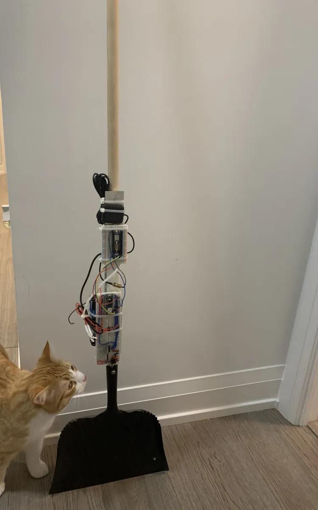
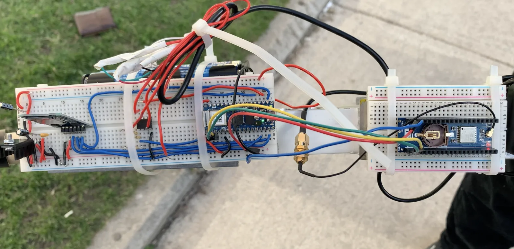
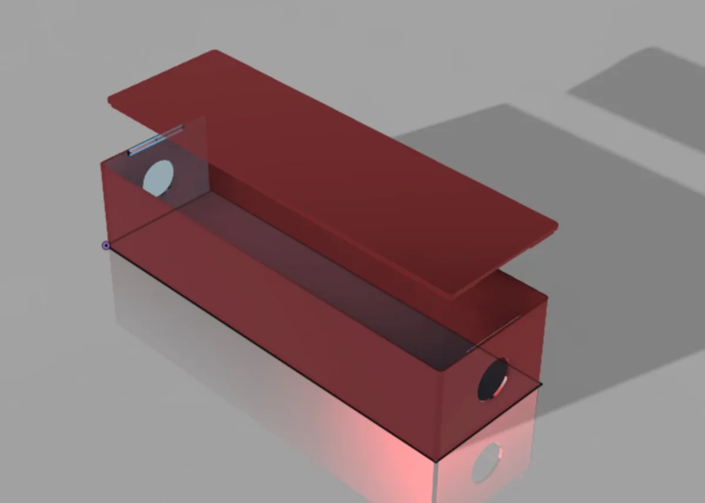
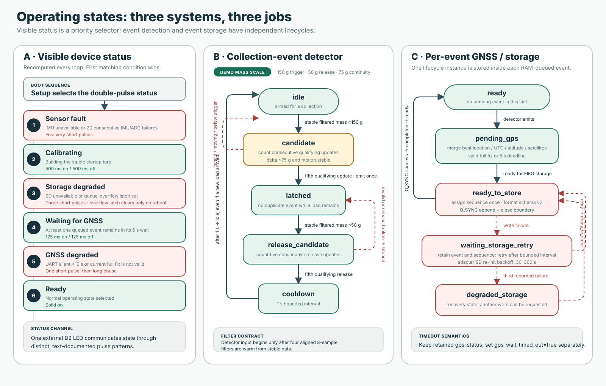
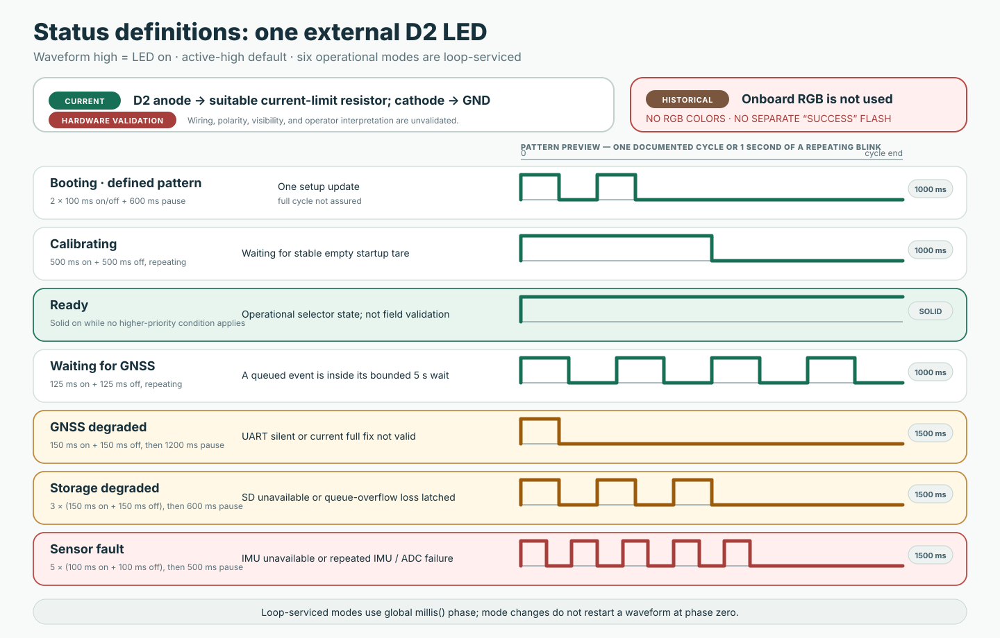
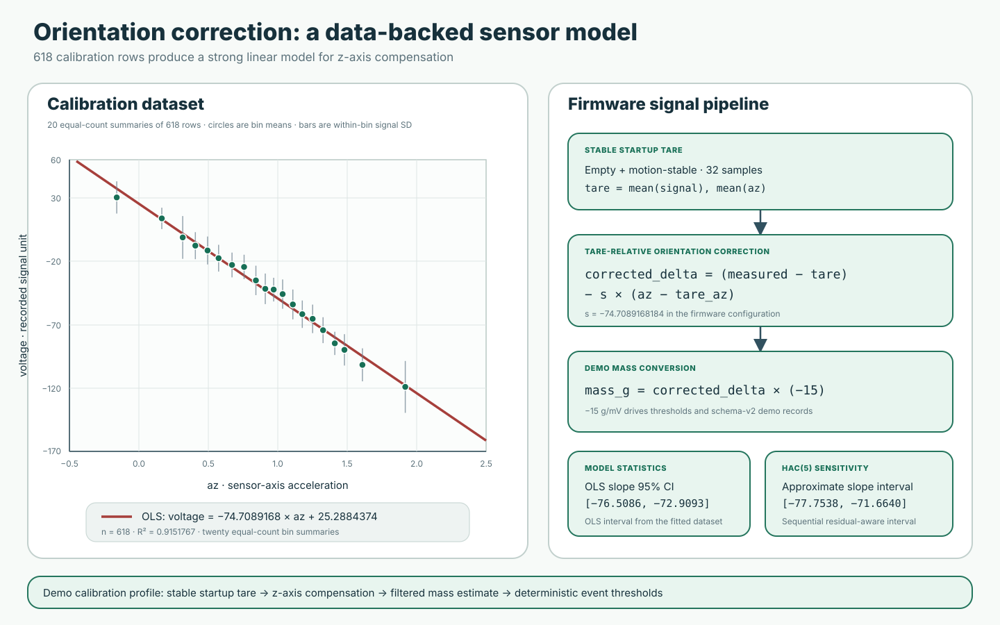
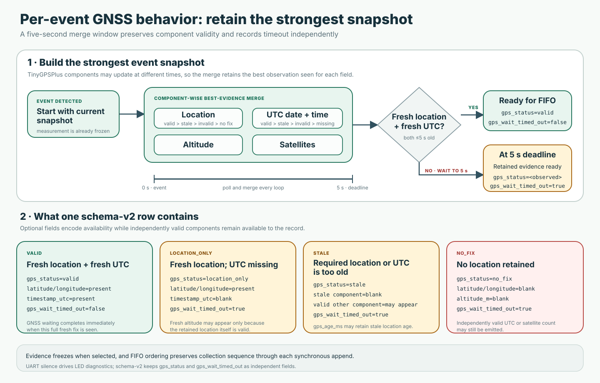

# Smart Shovel visual guide

Smart Shovel turns a familiar hand tool into a location-aware embedded sensing
platform. The project combines load sensing, inertial compensation, GNSS, durable
storage, deterministic event detection, and a versioned data contract in one
firmware architecture.

## Project prototype

The prototype makes the complete sensing stack visible: sensing, positioning,
storage, controller, and supporting electronics are mounted directly along the
shovel shaft for an easy-to-follow engineering demonstration.

<table>
  <tr>
    <td width="62%">
      
      <br><strong>Complete Smart Shovel prototype.</strong> The exposed layout makes each subsystem easy to identify.
    </td>
    <td width="38%">
      
      <br><strong>Upright prototype view.</strong> A full-length view of the sensing assembly and tool form factor.
    </td>
  </tr>
</table>



**Electronics close-up.** The modular layout exposes the signal chain and makes
the hardware architecture easy to explain subsystem by subsystem.



**Enclosure concept.** The CAD study explores how the electronics could be
packaged as a compact shaft-mounted module.

## System architecture


One Nano RP2040 Connect coordinates the complete pipeline. Analog load-cell data
and onboard IMU measurements feed aligned filters and a deterministic event
detector. Each accepted event receives GNSS evidence, a retry-stable identity,
and an exact schema-v2 representation before an `O_SYNC` microSD append. An
external D2 LED and nonblocking USB diagnostics expose device health.

## Collection cycle and data outcome


The event pipeline applies four aligned eight-sample filters, motion gates,
five-sample trigger and release confirmation, a four-entry FIFO, and a bounded
five-second GNSS window. The result is a durable, validated event row ready for
analysis and mapping workflows.

## Firmware states and visible status





Three independent state systems keep responsibilities clear: a priority-based
status selector, a duplicate-resistant collection detector, and a per-event
GNSS/storage lifecycle. The single external LED communicates the selected device
status through distinct pulse counts and timings, while the diagrams expose the
detector and event lifecycles in full.

## Orientation model and demo mass conversion



The checked-in `calib1.csv` dataset contains 618 usable rows and produces an OLS
slope of `-74.7089168` with `R² = 0.9151767`. Firmware combines that coefficient
with a stable 32-sample startup tare to compensate the load signal for shovel
orientation. The interactive walkthrough then applies the project’s demo
`-15 g/mV` mass conversion to exercise thresholding and record generation.

## GNSS evidence at event time



Location, UTC, altitude, and satellite data are merged independently during a
five-second event window. The component-wise merge retains the strongest
snapshot seen for each field, while `gps_status` and `gps_wait_timed_out` preserve
exactly how the record was assembled.

## Interactive collection-cycle demonstration

Open [`demo/index.html`](demo/index.html) to explore the collection cycle with
Play/Pause, Next, Reset, adjustable demo load and z-axis acceleration, and
GNSS/SD recovery scenarios. The walkthrough uses deterministic sample readings
so every control path and schema-v2 row is reproducible.

Serve the `docs/` directory locally and open `http://localhost:8000/demo/`:

```sh
python3 -m http.server 8000 --directory docs
```

The committed [`demo/smoke.html`](demo/smoke.html) page drives a successful
event and a GNSS-unavailable event in a same-origin fixture. It reports six
browser assertions covering the schema-v2 row and valid-location-only map rule.

The same static files are ready for GitHub Pages through **Settings → Pages →
Deploy from a branch → `main` → `/docs`**.
